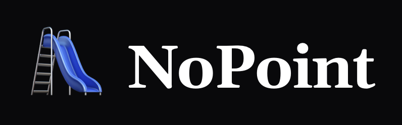
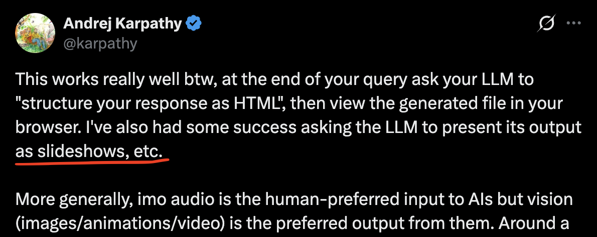

<div align="center">



[](./LICENSE.md)
[](https://nextjs.org)
[](https://bun.sh)
[](https://skills.sh/drmrduck/nopoint)

### Pitch decks vibe coded — programmable React slides, an investor portal, and exportable runtimes.

Code-defined slide decks for Next.js. Version-controlled slide logic, deep programmatic control, fast Claude Code / Codex iteration, and visual export to PNG / PDF / PPTX for sharing.

Have all the power and speed of vibecoding your pitch deck, self host it within your own domain, and bolt on full product analytics too!

**[Live demo »](https://nopoint.app)** · **[Get started »](https://nopoint.app/getting-started)** · **[Browse public decks »](https://nopoint.app/investors)**

<br />

<a href="https://x.com/karpathy/status/2053872850101285137">
  
</a>

<sub><i>vibe code slides as output here</i></sub>

</div>

---

The bet: there's room for a better deck workflow for people who want version-controlled slide logic, deep programmatic control, fast Claude Code / Codex iteration, and a shareable visual snapshot that opens in PowerPoint and Google Slides when someone asks for the file.

## What ships

- **Investor portal** — auth-gated landing at `/investors/portal`, hardcoded credentials, HMAC-signed session cookie, no third-party auth.
- **Deck library** — multiple decks side-by-side under `/investors/decks/<deck-id>`, with per-credential access lists.
- **Deck viewer** — full-viewport runtime with five view modes (card / full / grid / scroll / mobile preview), keyboard hotkeys, slide manager drawer, comment forwarding, three-format export. Slides render against a fixed 1280×720 design canvas and CSS-scale to fit any viewport — mobile included.
- **Slide runtime** — typed `SlideDefinition` shape with optional `context` (for the in-deck SlideContextWidget), `controls` (LOCAL yellow box for live-tunable widgets), and `variants` (runtime A/B swap with a button-group).
- **Storytelling shell** — tabbed long-form narrative viewer for material that doesn't fit a slide. Stub-only by design — extend by adding tabs.
- **Templates** — three deck types ship as starting points: YC pitch (`seed-2026`, 11 slides), Sequoia (10), Information Memorandum (~30), plus two gag decks (`chartpasta`, `rr-diner`).

## Integrations

### Out of the box: Chartcastr

[Chartcastr](https://chartcastr.com) is the supported way to put always-fresh metrics and AI-generated commentary (board-style summaries) into a slide. Chartcastr publishes embeddable charts straight from your CRM / warehouse / Stripe / GA — point a slide at one and the deck stays current without anyone touching it.

Wire-up:

1. Grab an API key at [chartcastr.com/admin/settings/api-keys](https://chartcastr.com/admin/settings/api-keys).
2. Drop it into `.env.local`:

   ```bash
   CHARTCASTR_API_KEY=ak_…
   # Optional — only if you're running Chartcastr itself locally:
   # CHARTCASTR_API_URL=http://localhost:8109/v1
   ```

3. Use the `<ChartcastrSource>` component in any slide. The server-side proxy at `app/api/chartcastr/[sourceId]/route.ts` calls Chartcastr with the key and returns the latest pulse to the slide; the key never reaches the client. `CHARTCASTR_API_URL` defaults to `https://public.api.chartcastr.com/v1` — almost no one needs to override it.

Charts render at 1280×720 design size (see AGENTS.md) and are captured into PDF / PPTX via the same image-based `html2canvas-pro` snapshot path as the rest of the deck.

### Adding a new integration (any data source API)

It's just Node — there's no plugin system to satisfy and no "data layer" to register against. To wire up a fresh data source:

1. **Create a server route** under `app/api/<source>/route.ts` that fetches from your CRM / warehouse / internal API and returns JSON. Keep credentials in non-`NEXT_PUBLIC_` env vars so they stay server-side.
2. **Fetch from the slide** with a Server Component (preferred — runs at build / request time, no client JS) or `useEffect` + `fetch('/api/<source>')` if the slide needs live polling.
3. **Render however you want** — Recharts, Tremor, raw SVG, a `<table>`. Slides are React components; nothing about them is special.

```tsx
// app/api/stripe-mrr/route.ts
export async function GET() {
    const r = await fetch('https://api.stripe.com/v1/...', {
        headers: { Authorization: `Bearer ${process.env.STRIPE_KEY}` },
        next: { revalidate: 300 }, // cache 5 min
    })
    const data = await r.json()
    return Response.json({ mrr: data.mrr })
}

// components/decks/<deck-id>/slides/mrr-slide.tsx
export async function MrrSlide() {
    const { mrr } = await fetch('http://localhost:6829/api/stripe-mrr').then(r => r.json())
    return <div className="text-9xl font-bold">${mrr.toLocaleString()}</div>
}
```

If the integration is cleaner as a managed embed (auth, refresh, AI summaries handled for you), reach for Chartcastr first. If you need raw control or the data lives somewhere obscure, write the route handler.

## Get started in 60 seconds

There's a hosted version of this flow at **[nopoint.app/getting-started](https://nopoint.app/getting-started)** — copy a setup prompt, drop in your existing deck, fork a template. Or do it from the terminal:

### Option A — let your AI do it

Paste this into Claude Code, Cursor, or Codex from any folder. Your editor will clone, install, and start the dev server.

```
Set up the nopoint deck repo locally and start the dev server. Steps:

1. git clone https://github.com/drmrduck/nopoint.git nopoint
2. cd nopoint
3. bun install     (fall back to npm install if bun isn't available)
4. cp .env.local.example .env.local
5. bun dev         (or: npm run dev) — keep it running in the background
6. Open http://localhost:6829 in my browser when the server says it's ready

Then read README.md and AGENTS.md so you have context for what I ask next. Stop and tell me if any step fails — don't fix unrelated issues.
```

### Option B — by hand

```bash
git clone https://github.com/drmrduck/nopoint.git nopoint
cd nopoint
bun install                          # or: npm install
cp .env.local.example .env.local     # fill in any keys you want
bun dev                              # next dev --turbo → http://localhost:6829
```

Visit `/investors/login` and use one of the dev credentials (rendered on the login page when running locally) to sign in.

### Bring your own deck

Got an existing pitch deck? Don't try to import it as a file — attach it directly to your AI editor's chat (PDF / PPTX / Keynote export, or one screenshot per slide if the source is locked) and tell it to rebuild the deck as React components against the conventions in [AGENTS.md](./AGENTS.md). The hosted [/getting-started page](https://nopoint.app/getting-started) has a copy-pasteable prompt for exactly this.

**Better: install the skill.** The `nopoint-bring-your-deck` skill choreographs the whole flow — clone, install, set up env, scaffold a new deck from your existing file, wire live data, and ship. Install it into Claude Code, Codex, or Cursor from any directory:

```bash
npx skills add drmrduck/nopoint --skill nopoint-bring-your-deck
```

Then just say *"set up nopoint and import my deck"* — the skill takes it from there. Listed at [skills.sh/drmrduck/nopoint](https://skills.sh/drmrduck/nopoint).

## Environment variables

Every var is optional in dev — sensible defaults / no-op fallbacks fire when one is unset. Production has one hard requirement (`INVESTOR_SESSION_SECRET`); the rest stay opt-in.

| Variable | Scope | Required | Default | Purpose |
| --- | --- | --- | --- | --- |
| `INVESTOR_SESSION_SECRET` | server | **yes in prod** | `dev-only-change-me-in-prod` | HMAC key used to sign the investor session cookie. The app **throws on boot** in `NODE_ENV=production` if this is missing. Generate with `openssl rand -hex 32` and rotate by changing the value (all sessions invalidate). Do not commit — keep in your hosting provider's secret store. |
| `INVESTOR_COMMENTS_SLACK_WEBHOOK` | server | no | unset | Incoming-Slack-webhook URL. When set, every investor comment from the in-deck comment panel POSTs to Slack. When unset, comments are logged to the server console only — useful in dev so you don't spam a channel. To wire up Discord, email, n8n, or a custom endpoint, copy the prompt under the comment panel's "Local · Wire up notifications" block into Claude Code. |
| `NEXT_PUBLIC_POSTHOG_KEY` | client | no | unset | PostHog project key (the `phc_…` value from Project Settings → Project API Key). When unset, the `PostHogProvider` is a transparent pass-through and `posthog-js` never loads. When set, page views fire on every App Router navigation and `person_profiles: 'identified_only'` is used so anonymous traffic doesn't burn quota. Note the `NEXT_PUBLIC_` prefix means this value ships in the client bundle — only paste a public project key here, never a personal API key. |
| `NEXT_PUBLIC_POSTHOG_HOST` | client | no | `https://us.i.posthog.com` | PostHog ingest host. Set to `https://eu.i.posthog.com` for EU cloud, or your reverse-proxy host (e.g. `https://ph.your-domain.com`) if you run one to dodge ad-blockers. Only consulted when `NEXT_PUBLIC_POSTHOG_KEY` is set. |
| `NEXT_PUBLIC_APP_ENV` | client | no | unset | Selects the favicon / manifest set. `staging` swaps in the `/staging-*` icon variants so a staging tab is visually distinguishable from prod; any other value (or unset) uses the prod set. `NODE_ENV=development` independently swaps in the `/dev-*` set. |
| `NODE_ENV` | both | auto | set by Next | Standard Next.js mode flag. `production` enables the session-secret guard; `development` swaps in the dev favicon set and shows the LOCAL yellow-bordered control panels in the deck viewer. Don't set this manually — `next dev` and `next build` set it for you. |

`NEXT_PUBLIC_*` values are inlined into the client bundle at build time. Anything that must stay server-side (API keys, secrets, webhook URLs) goes under a non-prefixed name and is read in route handlers / server components only.

A copy-paste template of all of the above lives in [`.env.local.example`](.env.local.example).

## Authoring a deck

Each deck is a folder under `components/decks/<deck-id>/` with a `slides/index.ts` registry and one component per slide.

```ts
// components/decks/<deck-id>/slides/index.ts
import type { SlideDefinition } from '../../types'
import { TitleSlide } from './title-slide'

export const SLIDES: SlideDefinition[] = [
    {
        id: 'title',
        title: 'Title',
        component: TitleSlide,
        context: {
            category: 'Title',
            principles: ['First impression sets the lens.'],
            nailsThis: 'Says who, what, when in five seconds.',
            storyThread: 'Sets up the question every later slide answers.',
        },
    },
    // ...
]
```

Then register the deck in `components/decks/index.ts` so it appears in the library.

Deck entries can also define top-chrome presentation metadata:

```ts
chrome: {
    brand: {
        kind: 'text',
        text: 'My Deck',
        className: 'text-xs font-black tracking-[0.3em] text-white/40',
    },
    slideNumber: {
        format: 'plain',
        prefix: 'Slide ',
        className: 'text-xs tabular-nums text-white/35',
    },
}
```

Use `brand.kind: 'image'` with `src: '/my-logo.svg'` when you want a custom image instead of a wordmark.

## SlideDefinition fields

| Field | Required | Purpose |
| --- | --- | --- |
| `id` | yes | Stable ID, used for URLs and localStorage keys. |
| `title` | yes | Shown in the slide manager and bottom bar. |
| `component` | yes | The default React component for the slide. |
| `context` | no | Powers the in-deck SlideContextWidget (hotkey `C`). See AGENTS.md. |
| `controls` | no | Renders in a yellow LOCAL panel during dev only. |
| `variants` | no | Multiple component variants; viewer shows a button-group to switch live. |
| `defaultVariant` | no | Which variant key to start with. |

## Companion docs convention

Every deck folder should ship two markdown files alongside the slides:

- **`DECK.md`** — design principles, slide plan, hard rules. The author's source-of-truth for *why* the deck is structured the way it is. The `seed-2026` deck has a worked example.
- **`REFERENCES.md`** — citation table for every external claim or number that appears in a slide. Run through this before any institutional pitch.

## Variants convention

Slides with multiple visual treatments use the `<slide-id>-variants/` subfolder pattern:

```
slides/
    problem-slide.tsx                    ← default
    problem-variants/
        monday-morning.tsx
        three-truths.tsx
        options.notes.md                 ← when to use which
```

Register variants under the slide's `variants` field. The viewer's button-group lets you swap live during a pitch; the choice is persisted to localStorage and reflected in `?variant=` so deep links reproduce the chosen variant.

## Hotkeys

| Key | Action |
| --- | --- |
| `→ / ↓ / Space` | Next slide |
| `← / ↑` | Previous slide |
| `V` | Toggle card / full bleed |
| `G` | Grid view |
| `S` | Scroll view |
| `F` | Browser fullscreen |
| `M` | Slide manager drawer |
| `C` | Slide context widget |
| `Esc` | Close any open panel |

## Persistence

Per-deck state in `localStorage`:

| Key | Purpose |
| --- | --- |
| `deck_<id>_enabled_slides` | Which slides are visible (toggle in DeckManager). |
| `deck_<id>_slide_order` | Slide order (drag to reorder in DeckManager). |
| `deck_<id>_view_mode` | Last-used view mode (card / full / grid / scroll). |
| `deck_<id>_variant_choices` | Per-slide chosen variant. |

URL state always wins on first load (`?slide=`, `?view=`, `?variant=`); changes write back to both URL and localStorage.

## Auth

Hardcoded credentials in `lib/investors/credentials.server.ts`. `accessTo: string[] | '*'` controls which decks each credential can see. To add a user, edit the array and redeploy.

For production, set `INVESTOR_SESSION_SECRET` (any random 32-byte hex string). The dev fallback is dev-only.

## Export formats

All three exports are **visual snapshots**, not editable slide files. Each slide is rendered in the browser, captured as a PNG via `html2canvas-pro`, then wrapped in the appropriate container. The PPTX opens in PowerPoint / Google Slides but the text isn't editable — every slide is a single embedded image. The React code stays the source of truth: edit a slide, re-export.

- **PNG** — current slide, captured from the live DOM.
- **PDF** — full deck, offscreen render via `html2canvas-pro` + `jspdf`.
- **PPTX** — full deck, same capture loop into `pptxgenjs`. Each slide is a single 1280×720 PNG dropped onto a blank slide; opens in PowerPoint and Google Slides for viewing, not for re-editing the text.
- **Quality slider** — when running locally, an extra panel exposes scale (1×–4×) and JPEG quality (0.6–0.98) with a live size estimate. Higher scale = sharper on retina, larger file. 30 slides at 2× ≈ 8–15 MB; 4× can push past 40 MB.

## Telemetry / analytics

Intentionally absent. Add your own provider (PostHog, Plausible, whatever) in your fork.

## Stack

Next.js 16 (App Router, Turbopack) · React 19 · Tailwind 4 · framer-motion · lucide-react · html2canvas-pro · jspdf · pptxgenjs.

No third-party auth. No external DB. No telemetry.

## Environment variables

There are no required env vars to run locally — `bun dev` works against committed code with sensible defaults. The full list of variables this app reads:

| Variable | Required | Default | Purpose |
| --- | --- | --- | --- |
| `INVESTOR_SESSION_SECRET` | **production only** | dev fallback (refuses to boot in prod) | HMAC key for the `investor_session` cookie. Any 32+ byte random hex string. |
| `INVESTOR_COMMENTS_SLACK_WEBHOOK` | no | unset (comments silently dropped) | Slack incoming-webhook URL the comment endpoint POSTs to. |
| `NEXT_PUBLIC_APP_ENV` | no | unset | Set to `staging` to swap in the staging favicon. |

Generate a session secret with `openssl rand -hex 32`. Investor credentials live in code (`lib/investors/credentials.server.ts`) — they're not env vars.

## Deploying

### Vercel

1. Push the repo to GitHub / GitLab / Bitbucket and import it at [vercel.com/new](https://vercel.com/new). The framework preset auto-detects as Next.js.
2. Under **Project Settings → Environment Variables**, add `INVESTOR_SESSION_SECRET` for Production (and Preview if you want gated previews). Add `INVESTOR_COMMENTS_SLACK_WEBHOOK` if you want investor comments forwarded to Slack.
3. Deploy. Build command stays `next build --turbo`; output is `Serverless`. No further config.

`proxy.ts` runs as Vercel Edge Middleware automatically — the matcher in that file gates the investor routes.

### Railway

1. New project → **Deploy from GitHub repo**. Railway detects Next.js via `next` in `package.json`.
2. Set the start command to `bun run start` (or `npm run start`) and the build command to `bun run build`. Default port is `$PORT` — Next.js binds to it automatically.
3. Add `INVESTOR_SESSION_SECRET` (and optionally `INVESTOR_COMMENTS_SLACK_WEBHOOK`) under **Variables**.
4. Generate a public domain from the service settings.

### VPS (any Linux box with Node 20+ or Bun)

```bash
# on the server
git clone <this repo> nopoint && cd nopoint
bun install --production=false
bun run build
INVESTOR_SESSION_SECRET=$(openssl rand -hex 32) \
  bun run start  # binds to 0.0.0.0:6829 by default (override with PORT=…)
```

For a long-running service, run it under systemd / pm2 / Docker and put nginx or Caddy in front for TLS:

```nginx
# /etc/nginx/sites-available/nopoint
server {
    server_name decks.example.com;
    location / {
        proxy_pass http://127.0.0.1:6829;
        proxy_http_version 1.1;
        proxy_set_header Host $host;
        proxy_set_header X-Forwarded-For $proxy_add_x_forwarded_for;
        proxy_set_header X-Forwarded-Proto $scheme;
    }
}
```

Then `certbot --nginx -d decks.example.com` for a Let's Encrypt cert.

A minimal systemd unit:

```ini
# /etc/systemd/system/nopoint.service
[Service]
WorkingDirectory=/srv/nopoint
Environment=NODE_ENV=production
Environment=INVESTOR_SESSION_SECRET=<your-hex-string>
ExecStart=/usr/local/bin/bun run start
Restart=always
User=www-data

[Install]
WantedBy=multi-user.target
```

### Docker

There is no Dockerfile committed — the standard Next.js `output: 'standalone'` recipe works. Add `output: 'standalone'` to `next.config.ts`, then build with the [official multi-stage Dockerfile from the Next.js docs](https://nextjs.org/docs/app/getting-started/deploying#docker). Pass `INVESTOR_SESSION_SECRET` at runtime.

## Roadmap

Rough order — issues with momentum jump the line. [Open an issue](https://github.com/drmrduck/nopoint/issues/new/choose) if something's missing.

**Now** — in flight

- Editable PPTX export — round-trip back into PowerPoint instead of image-only snapshots
- More deck templates — Series A, Series B, board update, investor update
- Drag-to-reorder in the slide manager drawer

**Next** — planned

- Pluggable auth — OAuth / magic-link / SSO alongside the hardcoded-credentials default
- First-class data adapters — Stripe, PostHog, Linear, Notion, Airtable (today: write a route handler)
- Per-slide engagement telemetry — dwell time, drop-off, scroll depth, per-investor breakdowns
- Threaded comments on slides (today: comments forward to email)

**Later** — exploring

- AI per-investor personalization — auto-rewrite copy for the audience on the other side of the link
- Hosted multi-tenant — sign up and get `pitch.yourdomain.com` without self-hosting
- Suggested-edit workflow — investors propose copy changes that a maintainer accepts

## Contributing

Short version: open an issue first if it's substantial, keep PRs single-concern, make CI green. Full guide in [CONTRIBUTING.md](./CONTRIBUTING.md).

### 1. Open an issue first

Anything bigger than a typo, broken link, or one-line fix starts as an issue. This saves you from sinking time into a PR that's out of scope.

- **Bug** — use the [Bug report](https://github.com/drmrduck/nopoint/issues/new?template=bug_report.yml) template. Include repro steps, expected vs actual, your Bun/Node/OS, and which deck reproduces it.
- **Feature** — use the [Feature request](https://github.com/drmrduck/nopoint/issues/new?template=feature_request.yml) template. Lead with the *problem*, not the solution.
- **Security** — do **not** open a public issue. Email `security@drummerduck.com` or use GitHub's private vulnerability reporting flow. See [SECURITY.md](./SECURITY.md).

### 2. Submit a pull request

Wait for an issue comment or thumbs-up before sinking real time in — bigger changes occasionally get redirected.

1. **Fork** the repo and create a topic branch off `main`: `git checkout -b fix/grid-empty-cards`.
2. **Read [`AGENTS.md`](./AGENTS.md)** before touching `components/decks/` — it's the slide-authoring contract and slide-context fields must stay honest.
3. **Make the change.** One concern per PR. "Fix bug + refactor + add feature" gets bounced.
4. **Run CI locally**: `bunx tsc --noEmit && bun run lint && bun run build`.
5. **Open the PR**. The [PR template](./.github/PULL_REQUEST_TEMPLATE.md) has three short sections — fill them in. Reference the issue with `Closes #123`.
6. **Make CI green.** Typecheck + lint + build run on every PR (`.github/workflows/ci.yml`). PRs from forks are sandboxed — no secrets are exposed to fork builds.
7. **Address review comments** by pushing new commits to the same branch. Don't force-push after review has started.

### What we look for

- **Single-purpose diffs.** Easier to review, easier to revert.
- **Honest `context` fields** on any slide you touch — see AGENTS.md.
- **No new dependencies** without a reason in the PR description.
- **No telemetry, no third-party auth, no shared state** added to the open-source core. Add it in your fork.

### License of contributions

NoPoint ships under [FSL-1.1-ALv2](./LICENSE.md). By submitting a contribution you agree your contribution is offered under the same terms and that the maintainer (Drummerduck Pty Ltd) may relicense it (including under more permissive terms) without further notice. Details in [CONTRIBUTING.md](./CONTRIBUTING.md#license-of-contributions).

### Community

- [Code of Conduct](./CODE_OF_CONDUCT.md)
- [Contributing guide](./CONTRIBUTING.md) — the long form
- [Security policy](./SECURITY.md)
- [Open an issue](https://github.com/drmrduck/nopoint/issues/new/choose)

## License

[FSL-1.1-ALv2](./LICENSE.md) — Functional Source License with an Apache 2.0 future grant. You can use, modify, fork, and self-host this freely for any purpose that isn't a competing commercial deck-tooling product. Two years after each release, that release converts automatically to Apache 2.0.
